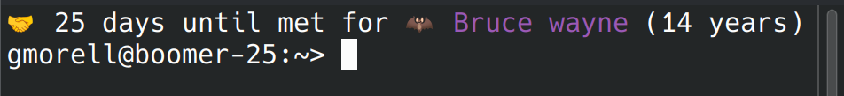
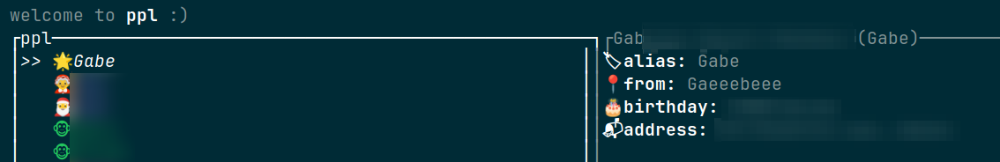
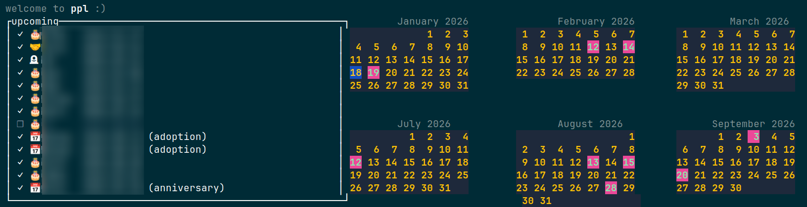
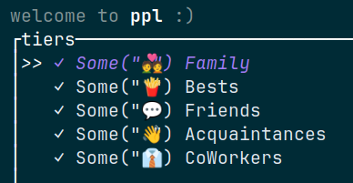
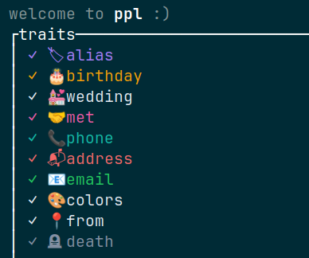

# PPL

A Rust CLI tool for managing and tracking significant dates for the people in your life.

## Features

Just enough to get by.

### Storage

Shipping a syncable database for the following information

- [x] PPL 
  - [x] Contact information
  - [x] Tiers
  - [x] Traits
  - [x] Significant Dates
- [x] Tier Defaults ( Emoji + Color )
- [x] Trait Defaults ( Emoji + Color )
- [x] Reminder Configuration

### MOTD

Put a message of the day in your bashrc to remind you of important dates.
`ppl motd` outputs:

#### Reminders

By default reminders will only be shown once per day unless otherwise configured. The options are:
- `OnlyOnce`,     // Default, Only the first time the motd is run that day`
- `OnceHourly`,   // Only once per hour, resetting at the top of the hour
- `Randomly(u8)`, // Will show this motd person randomly u8% every run
- `Always`,       // Will always show this person's upcoming
- `Never`,        // Never show this person's upcoming

### TUI

A Terminal UI for managing all the various stored information in the database.

#### Default View

PPL List, shows all configured ppl, their tiers, traits and information

#### Calendar View

Upcoming Anniversaries

#### Tier View

Add and Modify Tiers and Defaults

#### Trait View

Add and Modify Traits and Defaults

### Stats

`ppl stats` shows a summary of the current database

### Tiers & Traits

`ppl tiers` and `ppl traits` list all the tiers and traits in the database